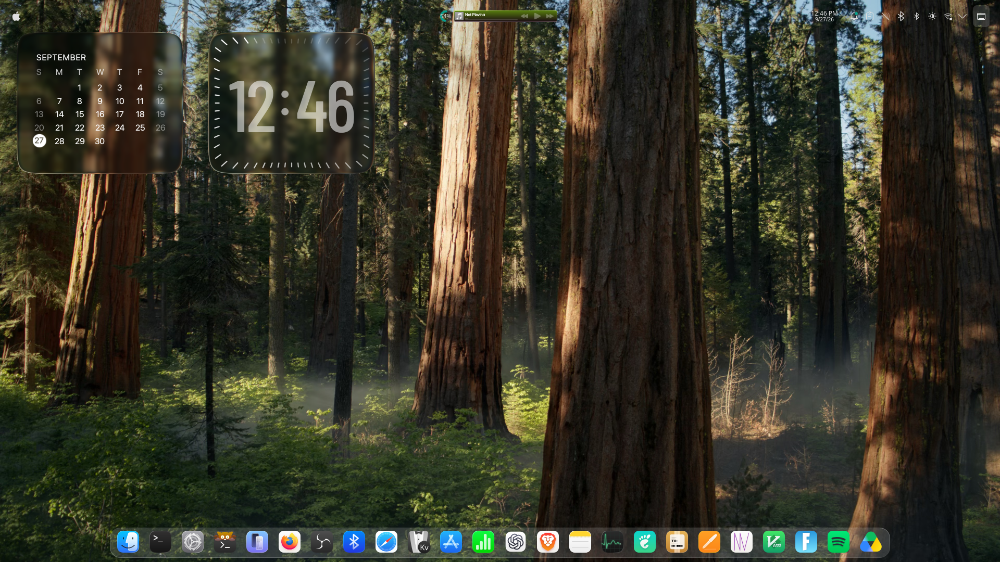
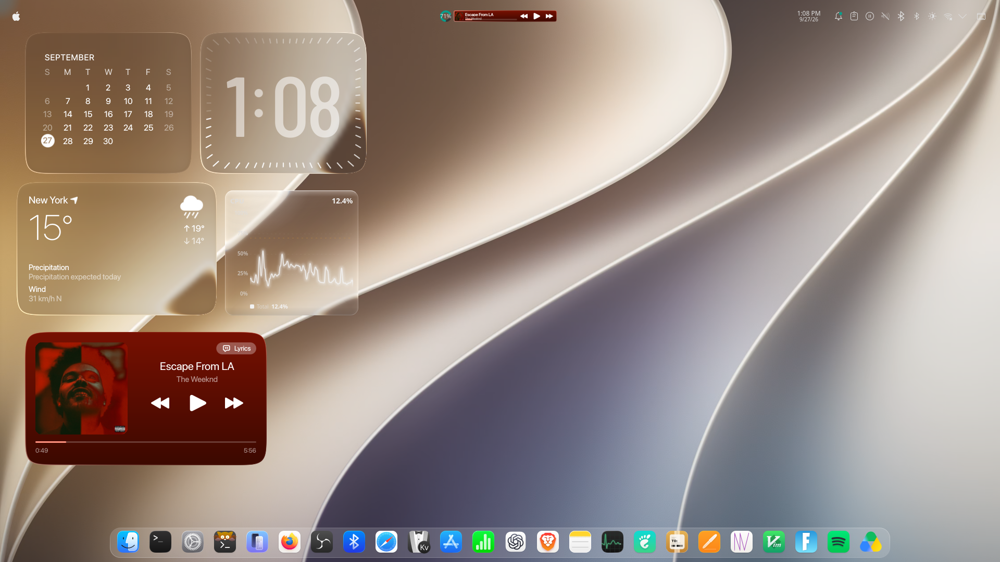

# 🏔️ My Arch Linux Dotfiles

Welcome to my personal **Arch Linux** environment repository configuration! This repository tracks my layout, custom shell customizations, and aesthetic assets.

## 🖥️ System Preview
Here is a look at my current setup configuration featuring a customized macOS theme layout style under KDE Plasma:



## 🔧 Components Included
*   **Shell:** Zsh (with a custom interactive theme layout configuration)
*   **Desktop Environment:** KDE Plasma (configured to match a clean macOS dock layout style)
*   **Application Theme style:** Kvantum theme manager engine
*   **Assets:** Personal wallpapers vault collection included inside the documents workspace

## 🚀 Installation & Quick Deployment
To safely replicate this bare repository system workspace environment onto another clean target Arch machine:
```bash
git clone --bare https://github.com \$HOME/.cfg
alias config='/usr/bin/git --git-dir=HOME/.cfg/ --work-tree=HOME'
config checkout
config config --local status.showUntrackedFiles no
```

### 🍦 Minimal Cream Aesthetic Setup

